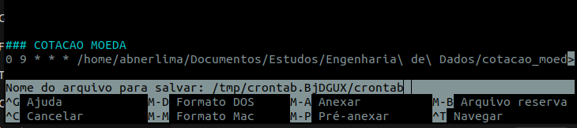

# 💸 Cotação de Moedas: USD e EUR → BRL com Python e BigQuery

Projeto de engenharia de dados que coleta, armazena e visualiza diariamente a cotação do **Dólar (USD)** e **Euro (EUR)** em relação ao Real (BRL), com envio automático dos dados para o **Google BigQuery** e agendamento via `cron`.

---

## 🚀 Tecnologias Utilizadas

- **Python**
- **Google BigQuery**
- **Pandas**
- **Matplotlib**
- **Crontab (agendamento)**
- **AwesomeAPI** (API de cotações)

---

## 📁 Estrutura do Projeto

```
cotacao_moedas/
├── scripts/                 # Módulos do pipeline
│   ├── coletar_dados.py
│   ├── processar_dados.py
│   ├── visualizar_dados.py
│   ├── enviar_bigquery.py
│   └── criar_tabela_bigquery.py
│
├── data/                    # Armazena CSV localmente
│   └── cotacoes.csv
│
├── main.py                 # Pipeline principal
├── run_pipeline.sh         # Script para agendamento via cron
├── requirements.txt        # Dependências do projeto
├── .gitignore              # Arquivos ignorados pelo Git
├── README.md               # Documentação do projeto
```

---

## 📦 Funcionalidades

- 🔄 Coleta diária da cotação USD e EUR via [AwesomeAPI](https://docs.awesomeapi.com.br/)
- 📁 Armazenamento local em CSV
- ☁️ Envio automático para uma tabela no BigQuery
- 📊 Visualização gráfica com `matplotlib`
- ⏱️ Execução automática com `cron`

---

## 🖼️ Prints (exemplo)

| DAG Cron | BigQuery | Gráfico |
|:--:|:--:|:--:|
|  |  |  |


---

## 📝 Como executar localmente
### 1. Clone o repositório

```
git clone https://github.com/seuusuario/cotacao_moedas.git
cd cotacao_moedas
```
### 2. Crie o ambiente virtual e instale dependências

```
python -m venv .venv
source .venv/bin/activate  # Linux/macOS
pip install -r requirements.txt
```
### 3. Adicione o arquivo chave.json da Service Account
```
caminho_credencial = "chave.json"
```
### ⏱️ Como agendar com cron
#### Crie ou edite o agendamento:
```
crontab -e
```
#### Adicione:
```
0 9 * * * /caminho/para/projeto/run_pipeline.sh >> /caminho/para/projeto/log.txt 2>&1
```
---
# 🧠 Autor
Desenvolvido por Abner Lima
📧 dev.abnerlima@gmail.com
